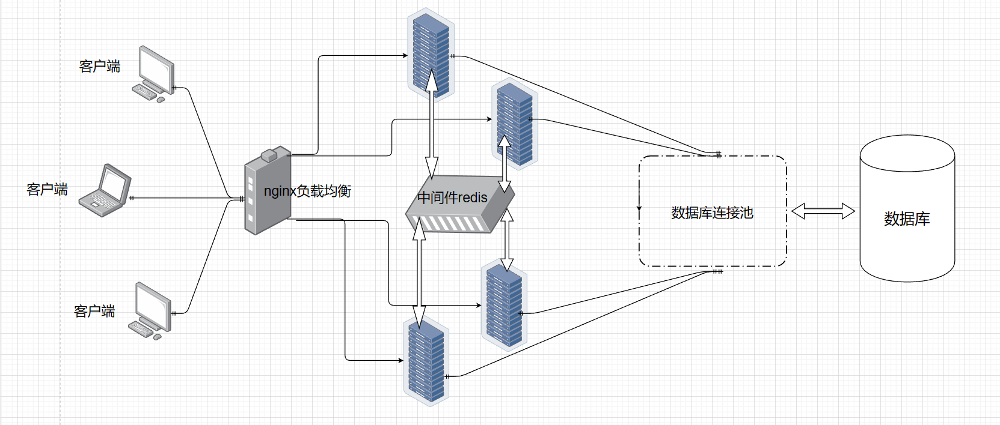

 
## 架构设计

## 开发环境

+ [开源muduo网络库](https://github.com/chenshuo/muduo)
+ [开源json库](https://github.com/nlohmann/json)
+ Boost库
+ Redis-6.2.6
+ Nginx-1.21.6
+ MySQL Server 8.0.34
+ Cmake 3.12.4
+ GCC 8.3.1 20190311 (Red Hat 8.3.1-3)
+ Centos 7
+ VS code

## 所用技术栈
 
+ Json序列化和反序列化
+ muduo网络库开发 
+ Nginx的TCP负载均衡器配置
+ Redis缓存服务器编程实践
+ 基于发布-订阅的服务器中间件redis消息队列编程实践
+ MySQL数据库编程CMake构建编译环境

## 项目功能

+ 业务功能
  + 客户端新用户注册
  + 客户端用户登录
  + 添加好友
  + 添加群聊
  + 一对一好友聊天
  + 多对多群聊
+ 技术功能
  + 基于ORM框架思想降低数据库模块与项目业务模块耦合度
  + 引入muduo网络库，借由回调函数解耦网络通信模块和项目业务模块耦合度
  + 引入[数据库连接池](https://github.com/Ge-ze/MysqlConnectionPool)(自制)提升服务器响应效率
  + 基于Redis发布-订阅实现跨服务器通信
  + 采用Nginx的TCP负载均衡功能实现集群部署

## 不足之处

+ 项目业务功能较为简单
+ 中间件Redis的发布-订阅功能较专业级消息队列MQ存在一定缺陷
+ 访问数据库效率方向还有可以提升的空间
